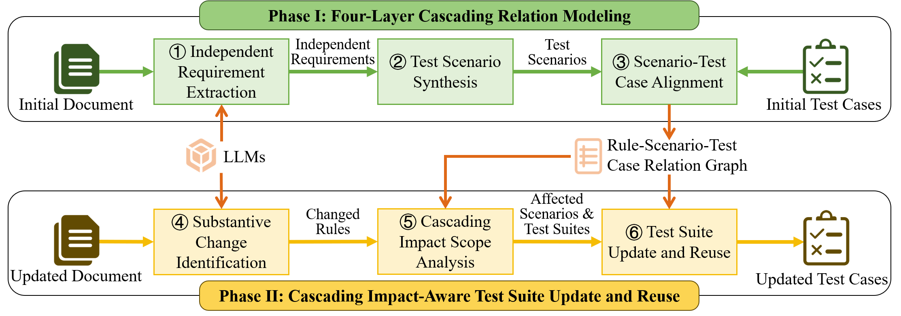
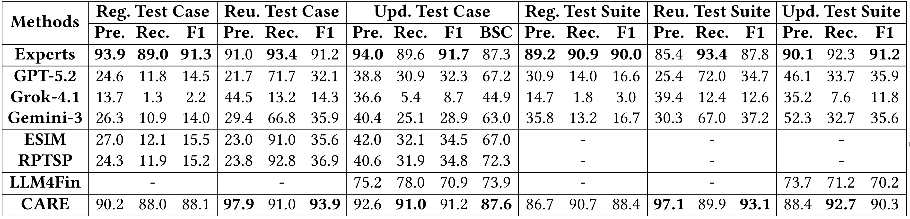
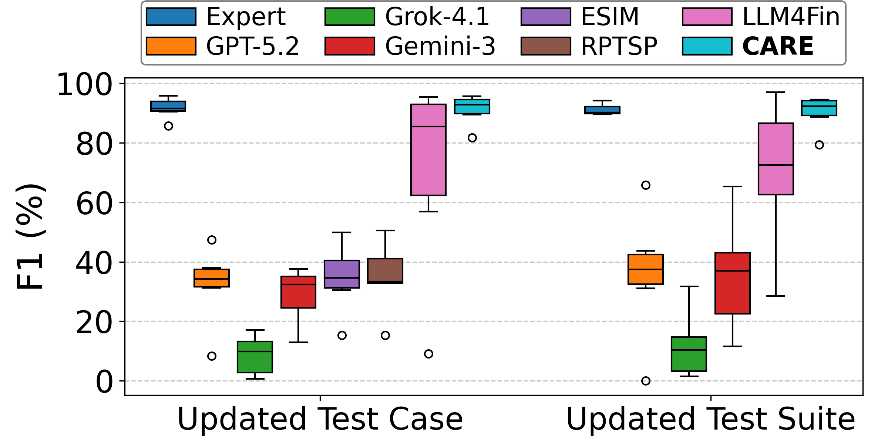
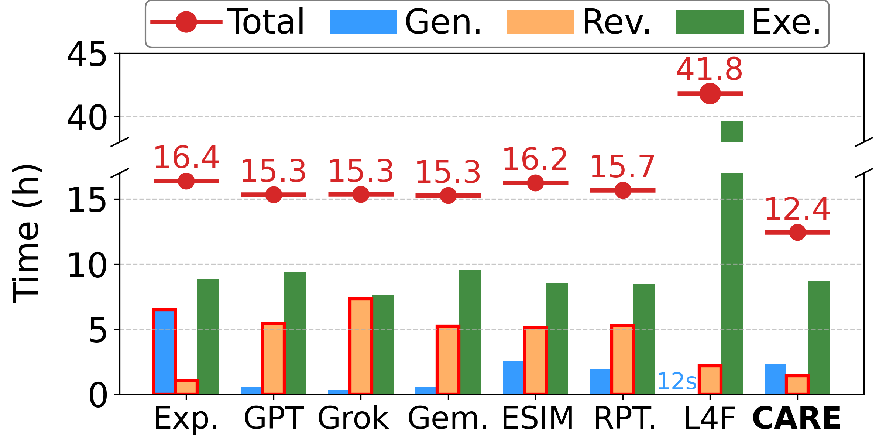
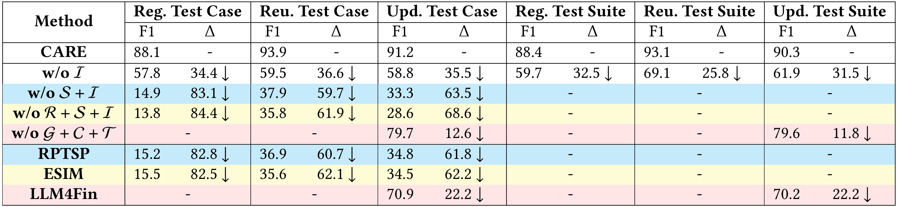
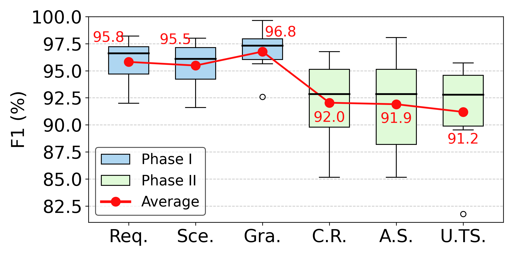
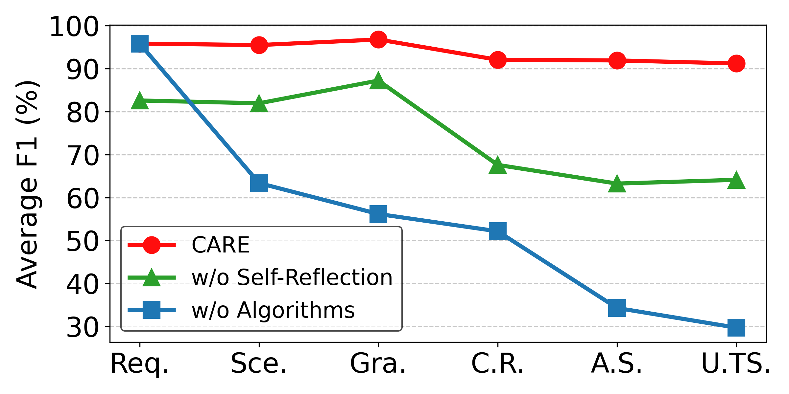
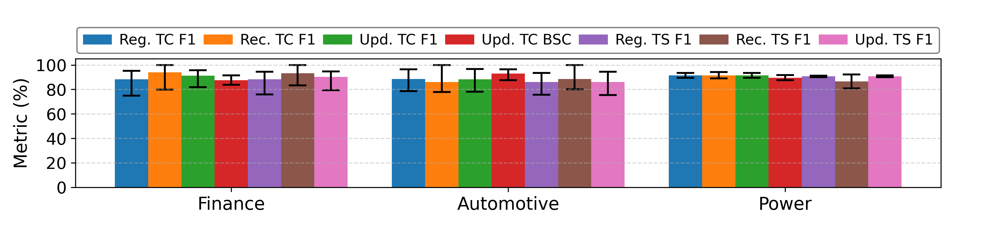

# CARE

CARE is a prototype tool for automatically updating and reusing existing test cases when facing regulation changes. It is the official implementation for paper "[CARE: Cascading Impact-Aware Compliance Test Suite Evolution under Regulatory Changes]()". In response to frequent changes in regulatory rules, this paper proposes CARE, a cascading impact-aware framework for automated compliance testing evolution. Existing approaches often suffer from over-reuse or missed updates because they treat rule changes in isolation and ignore complex interdependencies across testing artifacts. CARE addresses this issue by constructing a unified four-layer cascading relation model spanning Rule-Requirement-Scenario-Test Case, enabling fine-grained traceability across abstraction levels. By explicitly modeling how rule changes propagate and amplify along this chain, the framework precisely identifies impacted scenarios and test cases that need updating, while safely maximizing the reuse of unaffected ones.
Experiments conducted on real-world compliance testing tasks across multiple domains show that CARE achieves an average F1 of 90.3\% on updated test suites, outperforming existing methods by up to 164\% and approaching expert-level effectiveness. Ablation studies further demonstrate that explicit cascading impact modeling and handling are key contributors to these improvements. In addition, CARE substantially reduces manual effort and improves test maintenance efficiency, and indicates strong cross-domain generalization. This work highlights cascading impact propagation as a central challenge in regulation-driven test maintenance and shows that shifting from isolated rule handling to cascading impact-aware evolution is essential for achieving both high test quality and maintenance efficiency. 




## 1 Installation

### 1.1 Install step-by-step

All scripts are designed for and run on ***Ubuntu 22.04***.

1. Install dependencies.

    ```bash
    sudo apt update
    sudo apt upgrade -y
    sudo apt install build-essential zlib1g-dev libbz2-dev libncurses5-dev libgdbm-dev libnss3-dev libssl-dev libreadline-dev libffi-dev
    sudo apt-get install -y libgl1-mesa-dev
    sudo apt-get install libglib2.0-dev
    sudo apt install wget
    sudo apt install git
    ```

2. Install miniconda.

    ```bash
    cd ~
    wget https://repo.anaconda.com/miniconda/Miniconda3-latest-Linux-x86_64.sh
    bash Miniconda3-latest-Linux-x86_64.sh
    source ~/.bashrc
    ```

3. Create a virtual python environment and install all the required dependencies.
    ```bash
    git clone https://github.com/1769771051/CARE.git
    cd CARE
    conda create -n CARE python=3.9
    conda activate CARE
    pip install -r requirements.txt

    # Install flash-attention based on your CUDA version. For example:
    wget https://github.com/Dao-AILab/flash-attention/releases/download/v2.5.6/flash_attn-2.5.6+cu118torch2.0cxx11abiFALSE-cp39-cp39-linux_x86_64.whl
    pip install flash_attn-2.5.6+cu118torch2.0cxx11abiFALSE-cp39-cp39-linux_x86_64.whl
    
    pip install -e .
    ```

4. Download the used LLMs.
    ```bash
    mkdir model
    mkdir model/pretrained
    mkdir model/trained
    git lfs install
    git clone https://huggingface.co/a1769771051/CARE
    cp -r CARE/* model/trained/
    rm -rf CARE

    cd model/pretrained
    git clone https://huggingface.co/THUDM/glm-4-9b-chat
    git clone https://huggingface.co/Qwen/Qwen3-8B
    cd ../..

    ```

5. Run a test demo.
    ```bash
    cd reuse
    python update_testcase.py
    ```
After the command finishes running, the updated test cases are saved at **cache/new_testcase.json**.


## 2 Usage
We provide a streamlined interface, using commands to generate updated test cases for the updated document based on the initial document and initial test cases:

```bash
cd ours
python update_testcase.py --old_file {old_file} --old_testcases {old_testcases} --new_file {new_file} --new_testcases {new_testcases}
```

where {*old_file*} is the path of the initial regulation document, {*old_testcases*} is the path of the initial test case base, {*new_file*} is the path of the updated regulation document, and {*new_testcases*} is the file to save the output updated test cases.


## 3 Exeriment Evaluation

We provide the evaluation code generate the evaluation results in our paper. 

### Experiment I
To get the evaluation results for Experiment I in our paper, run the following command:

```bash
cd experiment/exp1
python generate_result_ours.py
# After the command finishes running, run
bash run_compute_acc.sh
bash run_compute_bsc.sh
bash run_compute_changed_rule_req_sce.sh
bash run_compute_reuse.sh
bash run_compute_testsuite_acc.sh
# Note that some commands may take a long time to run, and do not run them at the same time.
python draw_table.py
python draw_figure_2.py
python draw_figure_3.py
```

After running the above commands, you can get the result of Table 2 at **fig/exp1_table.csv**, Figure 7 (a) and (b) at **fig/exp1_var.pdf** and **fig/exp1_time.pdf**.

Table 2:


Figure 7 (a) and (b):




### Experiment II
```bash
To get the evaluation results for Experiment II in our paper, run the following command:
conda activate qwen
cd qwen3_service
nohup bash qwen3_service.sh >run.log &
sleep 30

cd ../experiment/exp2
conda activate testcase-reuse
python generate_testcase_no_requirement.py
python generate_testcase_no_scenario.py
python generate_testcase_directly.py
python generate_testcase_no_change_impact_analysis.py
python generate_testcase_ESIM.py
python generate_testcase_RPTSP.py
# After the command finishes running, run
bash run_compute_acc.sh
bash run_compute_bsc.sh
bash run_compute_changed_rule_req_sce.sh
bash run_compute_reuse.sh
bash run_compute_testsuite_acc.sh
# Note that some commands may take a long time to run, and do not run them at the same time.
python draw_table.py
```

After running the above commands, you can get the result of Table 4 at **fig/exp2_table.csv**.

Table 4:



### Experiment III
To get the evaluation results for Experiment III in our paper, run the following command:
```bash
cd experiment/exp2
python draw_figure.py
python draw_figure2.py
```

After running the above commands, you can get the result of Figure 8 (a) and (b) at **fig/exp2_step.pdf** and **fig/exp2_comp.pdf**.

Figure 8 (a) and (b):




### Experiment IV
To get the evaluation results for Experiment IV in our paper, run the following command:
```bash
cd experiment/exp3
python generate_result_ours.py
# After the command finishes running, run
bash run_compute_acc.sh
bash run_compute_bsc.sh
bash run_compute_reuse.sh
bash run_compute_testsuite_acc.sh
# Note that some commands may take a long time to run, and do not run them at the same time.
python draw_table.py
```

After running the above commands, you can get the result of Figure 9 at **fig/exp3.pdf**.

Figure 9:



---

<div align="center">

This project is licensed under the ***[MIT License](LICENSE)***.

*✨ Thanks for using **RAFT**!*

</div>